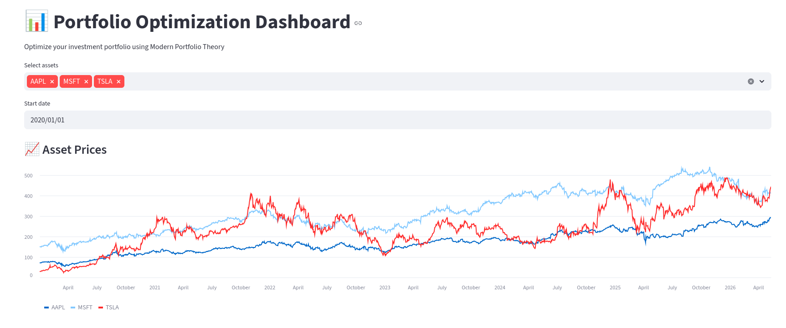

# 📊 Portfolio Optimization Dashboard


---

## 🚀 Overview

This project is a financial dashboard that optimizes stock portfolios using **Modern Portfolio Theory (MPT)**.

The application:
- Downloads real financial data from Yahoo Finance
- Computes returns and portfolio risk
- Calculates covariance matrices
- Optimizes portfolio allocation
- Maximizes Sharpe Ratio

---

## 📸 Dashboard Preview



---

## 🧠 Financial Mathematics

### Portfolio Return

Rp = Σ wiRi

### Portfolio Volatility

σ = √Var(R)

### Sharpe Ratio Optimization

Sharpe Ratio = (Expected Return - Risk Free Rate) / Volatility

---

## 📊 Features

✅ Real-time financial data  
✅ Portfolio optimization  
✅ Risk-return analysis  
✅ Monte Carlo simulation  
✅ Interactive Streamlit dashboard  
✅ Optimal asset allocation  

---

## 🛠️ Tech Stack

- Python
- Streamlit
- NumPy
- Pandas
- Matplotlib
- yFinance

---

## 📂 Project Structure

```bash
portfolio-optimization/
│
├── app.py
├── requirements.txt
├── README.md
├── src/
│   ├── portfolio.py
│   └── optimizer.py
└── assets/
```

---

## ▶️ Run Locally

Clone the repository:

```bash
git clone https://github.com/YOUR_USERNAME/portfolio-optimization.git
```

Install dependencies:

```bash
pip install -r requirements.txt
```

Run the app:

```bash
streamlit run app.py
```

---

## 💼 Project Purpose

This project demonstrates:
- Quantitative finance concepts
- Portfolio optimization
- Financial data analysis
- Python software engineering
- Interactive dashboard development

---

## 👨‍💻 Author

### Géraud Ogounchi

MSc Big Data & Data Science Student  
Interested in:
- Quantitative Finance
- Machine Learning
- Financial Data Science
- NLP

GitHub:
https://github.com/YOUR_USERNAME
